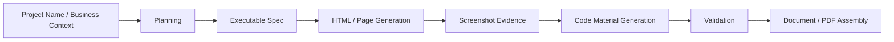

# SoftDoc Pipeline

[中文说明 (README_cn.md)](README_cn.md)

SoftDoc Pipeline is a public-facing snapshot of an automation pipeline for preparing software copyright application materials. It covers project planning, page/code generation, screenshot evidence, document assembly, and multiple entry points (`CLI`, `API`, `Desktop GUI`, `Web UI`).

## What It Is

Core goals:

- Turn project names and business context into structured project plans.
- Generate and assemble delivery artifacts (manuals, code materials, screenshots).
- Run consistency checks and risk gates during the pipeline.

This repository is published mainly for reference, code reading, and portfolio/archive purposes. It is not maintained as a turnkey public service, and it is not a legal guarantee of approval.

## Core Capabilities

- `CLI pipeline`: `plan -> spec -> html -> screenshot -> code -> verify -> document -> pdf -> freeze`
- `Desktop app`: `PyQt6 + qfluentwidgets`
- `Web app`: `React + Vite`
- `Backend API`: `FastAPI + WebSocket`
- `Code material generation`: business-aligned transformation from seed projects
- `Page material generation`: HTML output + screenshot evidence
- `Word/PDF artifacts`: manual and source-code document outputs
- `Quality gates`: spec/risk checks and runtime validation
- `Optional extension`: external submission integrations (not a core dependency)

## Pipeline Overview



## Project Structure

```text
.
├── main.py
├── run_api.py
├── gui/
├── web_ui/
├── api/
├── modules/
├── core/
├── config/
├── docs/
├── tests/
└── requirements.txt
```

## Tech Stack

- Python 3.10+
- FastAPI
- PyQt6
- React 19 + Vite + TypeScript
- Playwright
- python-docx / docxtpl / reportlab

## Demo

This repository does not provide a hosted demo. The public snapshot is meant for source browsing and light local inspection.

Quick entry points:

- API preview: `uv run python run_api.py`, then open `http://localhost:8000/docs`
- CLI preview: `uv run python main.py --project "demo-project" --plan-only`
- Web UI preview: `cd web_ui && npm install && npm run dev`

Sanitized screenshots from the public snapshot:

<p>
  
  
</p>
<p>
  
  
</p>
<p>
  
  
</p>
<p>
  
</p>

These images are sanitized for repository presentation only and do not represent a production environment.

If you only want to understand the system, start from:

- `docs/V2.1_ARCHITECTURE.md`
- `api/server.py`
- `modules/project_planner.py`
- `modules/document_generator.py`
- `web_ui/`

## No-Secret Quickstart

If you only want a safe preview route, use this path first. It avoids real API keys, submission accounts, browser sessions, and private templates.

### Preferred preview path

1. Install Python dependencies:

```powershell
uv venv .venv
.\.venv\Scripts\activate
uv pip install -r requirements.txt
```

2. Start the API and inspect Swagger only:

```powershell
uv run python run_api.py
```

Then open `http://localhost:8000/docs`.

3. Optionally verify the public Web UI build:

```powershell
cd web_ui
npm install
npm run build
```

4. Optionally run the public-safe regression subset:

```powershell
pytest tests/test_config.py tests/test_api_settings_safety.py tests/test_llm_budget.py -q
```

Stop here if your goal is inspection only. Full pipeline generation, document export, and submission-related flows usually require additional local-only configuration.

## Platform Support

| Surface | Windows | macOS | Linux | Notes |
| --- | --- | --- | --- | --- |
| API docs preview | Good | Good | Good | Safe inspection path; does not require running private submission flows. |
| Web UI build / preview | Good | Good | Good | `npm run build` is the safest public check. |
| CLI full pipeline | Partial | Partial | Partial | Usually needs local API config and environment reconstruction. |
| Desktop GUI | Best | Partial | Partial | Most maintained in Windows-oriented local workflows. |
| Document / PDF export | Best | Limited | Limited | Some export paths are more Windows-friendly. |
| Submission / signature flows | Local only | Local only | Local only | Depends on private accounts, browser state, and operator setup. |

## Repository Notes

This public repository is primarily intended for source browsing and architecture reference.

- Local configs, runtime data, generated outputs, and historical operator assets are intentionally excluded.
- Some internal or environment-specific flows may not be directly runnable after sanitization.
- If you only want to understand the project, start from `README`, `docs/`, `api/`, `modules/`, and `web_ui/`.

## Roadmap

- Publish a smaller, safer demo set for readers who want to inspect representative outputs.
- Replace more historical internal naming with the public-facing `SoftDoc Pipeline` name.
- Add broader smoke coverage for CLI, API, and Web UI in public CI.
- Continue separating runtime-only submission logic from generally reusable pipeline code.

## Optional Local Setup

### 1. Install dependencies

```powershell
uv venv .venv
.\.venv\Scripts\activate
uv pip install -r requirements.txt
playwright install chromium
```

Alternative (`pip`):

```powershell
python -m venv .venv
.\.venv\Scripts\activate
pip install -r requirements.txt
playwright install chromium
```

### 2. Prepare local config

Use example files only, and keep real credentials local:

- `config/api_config.json.example` -> `config/api_config.json`
- `gui_config.example.json` -> `gui_config.json`

Public example files:

- `config/api_config.json.example`: versioned provider + budget example for local copy only
- `gui_config.example.json`: versioned GUI preference example aligned with the current public snapshot

Local-only runtime files:

- `config/api_config.json`
- `config/general_settings.json`
- `config/submit_config.json`
- `config/browser_session.json`
- `gui_config.json`

`config.py` is a versioned loader module and is safe to keep public. Real credentials and local state should stay in ignored local JSON files and should not be part of the public snapshot.

### 3. Run services if needed

API:

```powershell
uv run python run_api.py
```

Desktop GUI:

```powershell
uv run python gui/app.py
```

Web UI:

```powershell
cd web_ui
npm install
npm run dev
```

### 4. Run pipeline if needed

The commands below usually require a valid local API configuration. They are not part of the no-secret preview route above.

Full pipeline:

```powershell
uv run python main.py --project "demo-project" --full-pipeline
```

Plan only:

```powershell
uv run python main.py --project "demo-project" --plan-only
```

## API

- API base: `http://localhost:8000`
- Swagger: `http://localhost:8000/docs`

Typical API domains:

- Project management
- Charter/spec management
- Pipeline execution and task progress
- UI skill planning and policy auto-fix
- Pre-submission risk checks
- Settings and LLM usage metrics

## Output

Artifacts are generated under `output/<project_name>/`, typically including:

- Plan and charter files
- Executable spec
- HTML pages and screenshots
- Aligned code materials
- Manual `docx/pdf`
- Source-code `pdf`
- Risk and validation reports
- Freeze package

## Known Limitations

- Sanitization removed local configs, runtime data, private templates, and operator assets, so some flows will not run end-to-end without local reconstruction.
- The repository keeps source references for submission-related modules, but those flows depend on private credentials, browser state, or environment-specific setup.
- Some document and GUI paths remain more Windows-friendly than cross-platform.
- Public docs are improved, but some code comments, package metadata, and UI strings still use the historical project name.

## Development

Run backend tests if you are adapting the code locally:

```powershell
pytest -q
```

Build Web UI if you modify the front-end:

```powershell
cd web_ui
npm run build
```

Recommended docs:

- `docs/V2.1_ARCHITECTURE.md`
- `docs/V2.2_PROCESS_UPGRADE.md`
- `docs/V3.1_RUNTIME_SKILL_GATE_GUIDE.md`

## Open-Source Safety Checklist

Do not publish:

- Real API keys, cookies, tokens, account passwords
- Local runtime configs (`config/api_config.json`, `config/submit_config.json`, `config/browser_session.json`)
- Runtime data (`data/task_logs/`, project/account/runtime state files)
- Generated outputs (`output/`, `temp_build/`, `logs/`)
- Any file containing real project/customer/private session data

## Disclaimer

This project improves document generation and validation efficiency. It does not replace legal/compliance review. Final submission responsibility remains with the submitting party.

## License

This repository is released under the MIT License. See `LICENSE`.

Repository URL: `https://github.com/CommitHu502Craft/SoftDoc-Pipeline.git`
