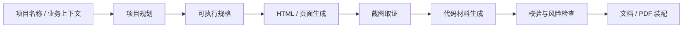
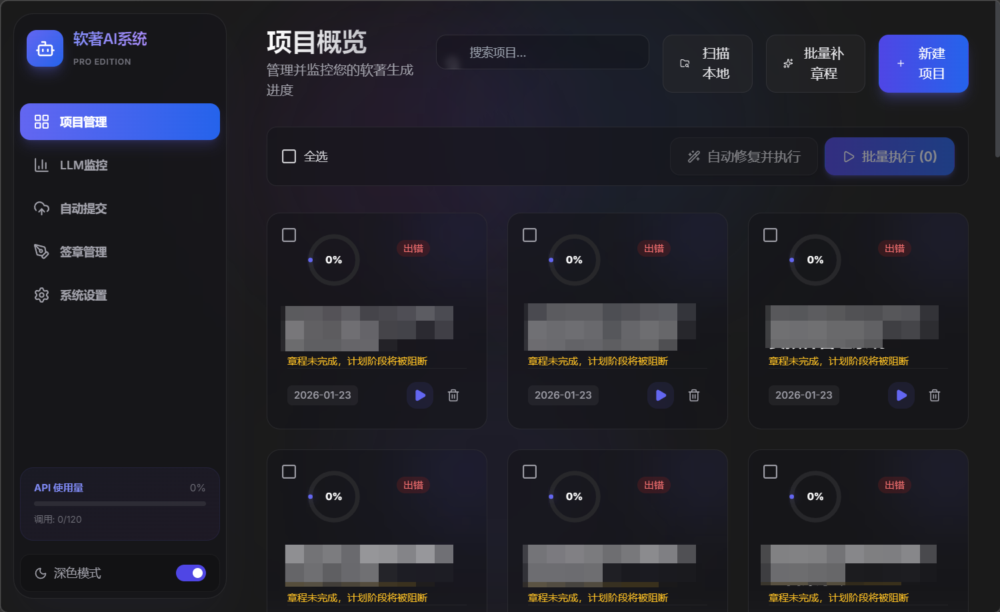
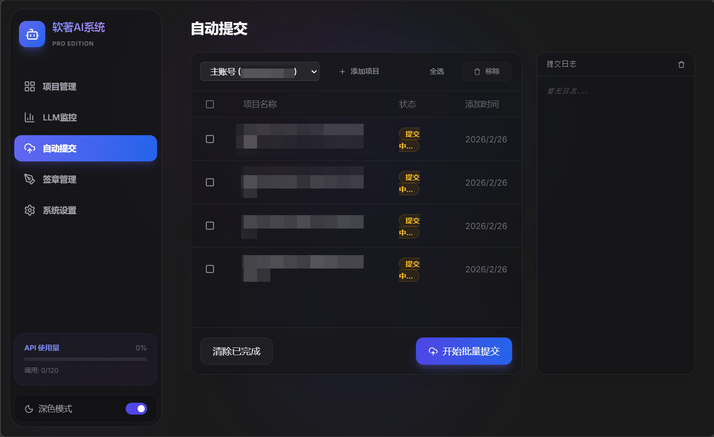
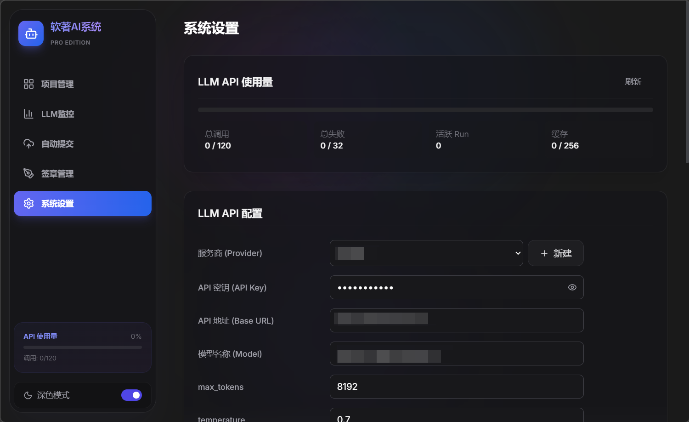
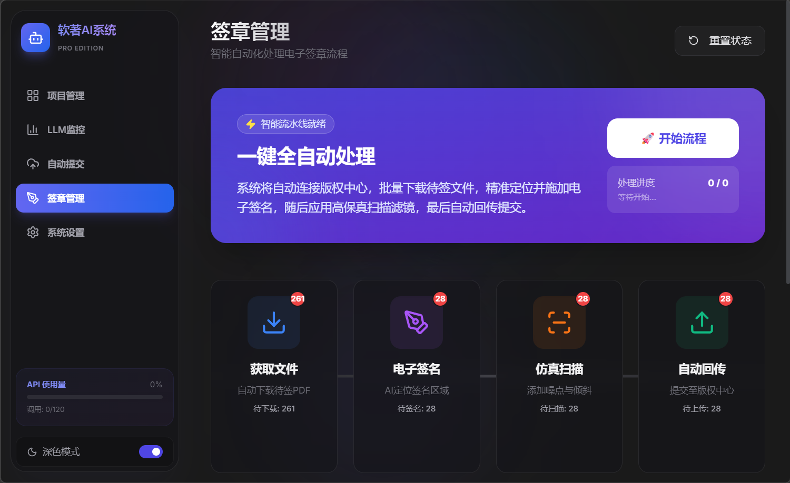
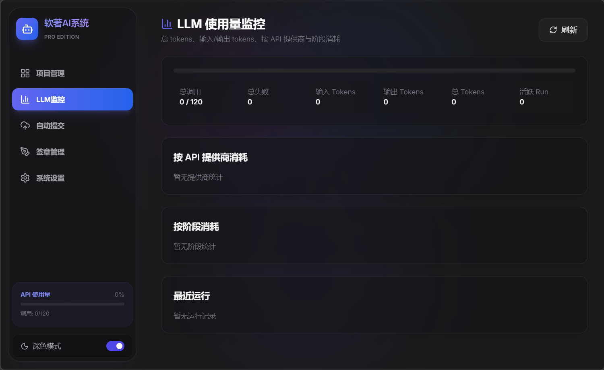
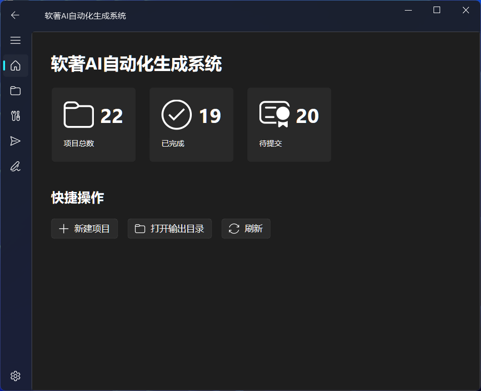
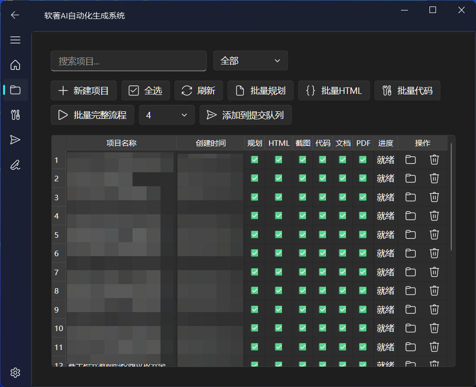

# SoftDoc Pipeline

[English README (README.md)](README.md)

SoftDoc Pipeline 是一个面向软件著作权申报材料整理场景的公开展示仓库，保留了项目规划、页面与代码生成、截图取证、文档装配，以及桌面端 / Web 端 / API 等工程结构。

这个仓库更适合把它理解为“申报材料生产流水线”而不是单一脚本。核心能力集中在三件事：

- 把项目名称和业务描述整理成结构化项目方案
- 生成或组装说明材料、代码材料、页面截图等交付物
- 在生成链路中做一致性校验、风险检查和结果归档

## 项目定位

本项目适用于以下场景：

- 需要批量整理软件著作权申报材料
- 希望把项目规划、页面生成、代码整理、截图、文档导出串成流水线
- 希望同时提供 CLI、桌面 GUI、Web UI 和 HTTP API

不建议把它理解为“提交即通过”的保证系统。它更像一个自动化生产与校验工具，最终材料仍应由人工复核。
这个仓库目前更适合作为源码展示、架构参考和归档副本，而不是面向陌生用户的开箱即用产品。

## 主要能力

- `CLI 流水线`：支持按阶段执行 `plan -> spec -> html -> screenshot -> code -> verify -> document -> pdf -> freeze`
- `桌面端`：基于 `PyQt6 + qfluentwidgets`
- `Web 端`：基于 `React + Vite`
- `后端 API`：基于 `FastAPI + WebSocket`
- `代码材料生成`：从多语言种子工程出发做业务化改写与整理
- `页面材料生成`：生成 HTML 页面并输出截图证据
- `Word / PDF 产物`：组装说明书、源代码 PDF 等申报材料
- `项目校验能力`：包含规格校验、风险预检、部分自动修复与运行时校验逻辑
- `可选扩展`：可接入外部提交流程能力（默认不作为主流程依赖）

## 流水线总览



## 仓库结构

当前仓库已经是一个多入口、多模块工程。公开仓库建议读者先从下面这些目录理解：

```text
.
├── main.py                    # CLI 主入口
├── run_api.py                 # FastAPI 启动入口
├── gui/                       # PyQt6 桌面端
├── web_ui/                    # React Web 前端
├── api/                       # HTTP / WebSocket API
├── modules/                   # 核心业务模块
├── core/                      # 基础设施与通用执行层
├── config/                    # JSON 配置模板与运行配置
├── docs/                      # 架构与流程文档
├── tests/                     # 自动化测试
└── requirements.txt           # Python 依赖
```

### 目录说明

- `modules/`
  核心业务层，覆盖项目规划、HTML 生成、代码生成、文档生成、截图、风险预检、Skill 编排等能力。
- `core/`
  放置并发执行、LLM 调用、预算控制、随机化配置、日志等通用基础设施。
- `api/`
  对外暴露项目管理、任务执行、设置管理、日志与状态查询接口。
- `gui/`
  桌面客户端，适合本地操作与人工校验。
- `web_ui/`
  Web 界面，适合前后端分离部署或局域网协作。
- `docs/`
  保存架构设计和版本演进文档，适合二次开发前阅读。

## 技术栈

- Python 3.10+
- FastAPI
- PyQt6
- React 19 + Vite + TypeScript
- Playwright
- python-docx / docxtpl / reportlab

说明：

- `docx2pdf` 和部分 GUI 能力在 Windows 上体验更完整
- 如果只运行 API 或部分生成流程，非 Windows 环境也可按需裁剪

## Demo

这个公开仓库不提供线上 Demo，当前更适合做源码浏览、结构理解和轻量本地预览。

如果你只想快速看入口，可直接用下面几种方式：

- API 预览：`uv run python run_api.py`，然后访问 `http://localhost:8000/docs`
- CLI 预览：`uv run python main.py --project "demo-project" --plan-only`
- Web UI 预览：`cd web_ui && npm install && npm run dev`

下面这组截图来自公开版的脱敏演示画面：

<p>
  
  
</p>
<p>
  
  
</p>
<p>
  
  
</p>
<p>
  
</p>

这些截图仅用于公开仓库展示，不代表生产环境，也不包含真实账号、真实项目或运行态数据。

如果你只是想判断这个项目值不值得继续读，建议优先看：

- `docs/V2.1_ARCHITECTURE.md`
- `api/server.py`
- `modules/project_planner.py`
- `modules/document_generator.py`
- `web_ui/`

## 无密钥快速预览

如果你当前只是想安全地看一遍公开仓库，优先走下面这条路径。它不依赖真实 API Key、提交账号、浏览器会话或私有模板。

### 推荐预览路径

1. 安装 Python 依赖：

```powershell
uv venv .venv
.\.venv\Scripts\activate
uv pip install -r requirements.txt
```

2. 只启动 API 并查看 Swagger：

```powershell
uv run python run_api.py
```

然后访问 `http://localhost:8000/docs`。

3. 如有需要，再验证公开版 Web UI 是否能构建：

```powershell
cd web_ui
npm install
npm run build
```

4. 如有需要，再跑公开安全的测试子集：

```powershell
pytest tests/test_config.py tests/test_api_settings_safety.py tests/test_llm_budget.py -q
```

如果你的目标只是预览，到这里就可以停。完整流水线、文档导出和提交相关能力通常还需要额外的本地配置。

## 平台支持

| 入口 / 能力 | Windows | macOS | Linux | 说明 |
| --- | --- | --- | --- | --- |
| API 文档预览 | 良好 | 良好 | 良好 | 最适合公开仓库阅读者的安全入口。 |
| Web UI 构建 / 预览 | 良好 | 良好 | 良好 | `npm run build` 是最稳的公开验证方式。 |
| CLI 完整流水线 | 部分支持 | 部分支持 | 部分支持 | 通常仍需要本地 API 配置和环境重建。 |
| 桌面 GUI | 最佳 | 部分支持 | 部分支持 | 维护和使用习惯明显更偏 Windows。 |
| 文档 / PDF 导出 | 最佳 | 有限 | 有限 | 部分导出链路更偏 Windows 环境。 |
| 提交 / 签章相关流程 | 仅本地 | 仅本地 | 仅本地 | 依赖私有账号、浏览器状态和操作环境。 |

## 仓库说明

这个公开仓库主要用于展示源码与结构，而不是保证可直接运行。

- 本地配置、运行态数据、生成产物和历史操作资产已按公开仓库标准做了剥离或忽略。
- 因为做过脱敏与裁剪，部分流程即使保留代码，也不保证可以直接复现原始环境。
- 如果你只是想了解项目，建议优先阅读 `README`、`docs/`、`api/`、`modules/` 和 `web_ui/`。

## Roadmap

- 补一套更小、更安全的 Demo 样例，方便公开阅读者理解输出形态。
- 把更多历史内部命名替换成公开名称 `SoftDoc Pipeline`。
- 给 CLI、API、Web UI 增加更稳定的公开 CI 冒烟检查。
- 继续把运行态提交流程逻辑和可复用流水线能力拆分得更清楚。

## 可选本地运行

### 1. 安装 Python 依赖

```powershell
uv venv .venv
.\.venv\Scripts\activate
uv pip install -r requirements.txt
playwright install chromium
```

如果你不用 `uv`，也可以用 `pip`：

```powershell
python -m venv .venv
.\.venv\Scripts\activate
pip install -r requirements.txt
playwright install chromium
```

### 2. 准备配置文件

请只使用示例配置创建本地配置，不要把真实配置提交回仓库。

- `config/api_config.json.example` -> `config/api_config.json`
- `gui_config.example.json` -> `gui_config.json`

公开示例文件：

- `config/api_config.json.example`：版本化保留的 provider / budget 示例，只用于本地复制
- `gui_config.example.json`：和当前公开版默认行为对齐的 GUI 偏好示例

仅应保留在本地的运行态文件：

- `config/api_config.json`
- `config/general_settings.json`
- `config/submit_config.json`
- `config/browser_session.json`
- `gui_config.json`

`config.py` 本身是仓库内版本化的加载模块，可以公开；真实密钥、账号和本地运行状态应只保留在本地已忽略的 JSON 文件中，不应进入公开快照。

至少需要检查：

- API Key
- 模型名称和服务端点
- 输出目录
- 浏览器会话和账号配置是否为空或为测试值

### 3. 如有需要再启动

启动 API：

```powershell
uv run python run_api.py
```

启动桌面端：

```powershell
uv run python gui/app.py
```

启动 Web 前端：

```powershell
cd web_ui
npm install
npm run dev
```

### 4. 如有需要再执行 CLI 流水线

下面这些命令通常需要本地有效的 API 配置，不属于上面的“无密钥快速预览”路径。

完整流水线：

```powershell
uv run python main.py --project "示例项目" --full-pipeline
```

只执行规划：

```powershell
uv run python main.py --project "示例项目" --plan-only
```

常见单步参数：

- `--plan-only`
- `--html-only`
- `--code-only`
- `--screenshot-only`
- `--pdf-only`
- `--doc-only`

## API 概览

后端默认地址：

- API: `http://localhost:8000`
- Swagger: `http://localhost:8000/docs`

当前 API 覆盖的能力主要包括：

- 项目管理
- 章程与规格管理
- 流水线执行与任务进度
- UI Skill 规划与策略修复
- 申报前风险预检
- 系统设置和 LLM 用量查看

如果你只准备对接前端，优先阅读：

- `api/server.py`
- `api/models.py`
- `web_ui/api.ts`

## 输出产物

默认产物位于 `output/<项目名>/`，常见内容包括：

- 项目规划与章程文件
- 可执行规格文件
- HTML 页面
- 页面截图
- 业务化整理后的代码目录
- 软件说明书 `docx/pdf`
- 源代码 `pdf`
- 风险检查与校验报告
- 冻结归档包

## 已知限制

- 因为公开版已经去掉了本地配置、运行态数据、私有模板和操作资产，所以不少流程不能直接端到端跑通。
- 仓库里保留了部分提交流程相关源码，但这些能力依赖私有账号、浏览器会话或特定环境，不属于公开即用能力。
- 部分文档生成和 GUI 路径仍然更偏 Windows 环境。
- 虽然 README 已做公开化整理，但代码注释、包名和少量界面文案里仍能看到历史项目名。

## 测试与开发

如果你需要本地改造代码，可运行后端测试：

```powershell
pytest -q
```

如果你修改了前端，可构建 Web 前端：

```powershell
cd web_ui
npm run build
```

建议二次开发优先阅读：

- `docs/V2.1_ARCHITECTURE.md`
- `docs/V2.2_PROCESS_UPGRADE.md`
- `docs/V3.1_RUNTIME_SKILL_GATE_GUIDE.md`

## 开源前的安全处理

这个项目包含明显的本地运行痕迹和潜在敏感目录。完全开源前，建议至少完成下面这些检查。

### 不要公开的内容

- 真实 API Key、Token、Cookie、账号密码
- `config/api_config.json`
- `config/submit_config.json`
- `config/browser_session.json`
- `data/accounts.json`
- `data/task_logs/`
- `output/`、`temp_build/`、`logs/`
- 任何带真实项目名、客户名、提交记录、浏览器会话的数据文件

### 建议保留为示例的内容

- `config/api_config.json.example`
- `gui_config.example.json`

### 开源前建议再做一次

- 全仓库搜索 `sk-`、`token`、`password`、`cookie`、`session`
- 清理 `data/` 下的真实业务数据
- 检查 `README`、`docs/`、截图和模板中是否包含真实机构信息
- 确认 `.gitignore` 已覆盖本地配置和运行产物

## 公开仓库的阅读方式

公开版本建议主要围绕源码、模板、测试和文档理解项目。运行过程中本地会生成 `data/`、`output/` 等目录，但这些属于运行态产物，不应视为仓库核心结构，也不建议纳入版本控制。

## 免责声明

本项目用于提高材料整理、生成与校验效率，不构成法律、合规或申报结果承诺。任何对外提交的材料都应进行人工复核，并由提交方自行承担真实性与合规性责任。

## 许可证

本仓库采用 MIT License，详见 `LICENSE`。

仓库地址：`https://github.com/CommitHu502Craft/SoftDoc-Pipeline.git`
