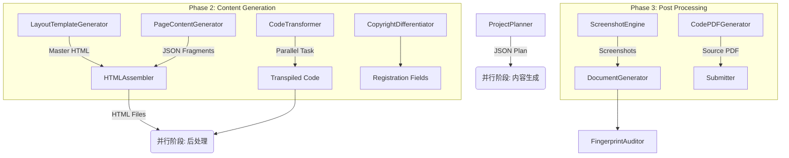

# V2.1 架构文档：混合生成流水线 (Hybrid Generation Pipeline)

> 建议配合 `docs/PURPOSE_METHOD_THINKING.md` 一起阅读。  
> 本文偏“结构与模块分工”，后者偏“设计目的、方法与思考流程”。
> V2.2 在此架构上新增了立项章程门禁、可执行规格、运行验证与冻结提交包，详见 `docs/V2.2_PROCESS_UPGRADE.md`。
> V3.1 新增运行时 Skill、策略裁决与硬门禁闭环，详见 `docs/V3.1_RUNTIME_SKILL_GATE_GUIDE.md`。

## 1. 核心设计理念

V2.1 版本彻底重构了系统的核心生成引擎，从 V2.0 的 "单体生成模式" 升级为 **"Layout-Content 分离模式"**。

### 核心变更
| 特性 | V2.0 (旧版) | V2.1 (新版) |
| :--- | :--- | :--- |
| **HTML 生成** | LLM 生成完整 HTML (结构+内容) | **Layout** (母版) + **Content** (片段) + **Assembly** (组装) |
| **并发模型** | 串行 (Serial) | **全异步并行 (Asyncio + ThreadPool)** |
| **代码生成** | 简单的正则替换 | **AST 变换 + 物理混淆 + 业务实体映射** |
| **去重机制** | 无 | **SimHash 指纹审计 + 随机化 CSS 类名** |

## 2. 流水线架构 (Pipeline Architecture)

新的 `main.py` 采用 `asyncio` 编排整个生命周期。V2.2 默认顺序已升级为：  
`plan -> spec -> html -> screenshot -> code -> verify -> document -> pdf -> freeze`



## 3. 模块详解

### 3.1 核心执行器 (`core/parallel_executor.py`)
- 基于 `asyncio.Semaphore` 实现 API 速率限制 (Rate Limiting)。
- 使用 `ThreadPoolExecutor` 处理 CPU 密集型任务 (如哈希计算)。
- 支持进度回调，适配 GUI 进度条。

### 3.2 HTML 生成三部曲
1.  **Layout (母版)**: `LayoutTemplateGenerator` 生成带有随机 CSS 类名 (`app-shell-x82`) 的空壳。
2.  **Content (内容)**: `PageContentGenerator` 根据 `business_context` 生成 JSON 数据 (Chart Config + Table Data)。
3.  **Assembly (组装)**: `HTMLAssembler` 本地高速合并，注入 ECharts 脚本。

### 3.3 代码变换引擎 (`modules/code_transformer.py`)
- **并行化**: 同时对 5+ 个文件进行 LLM 转译。
- **实体映射**: 自动将 `User` 映射为 `ForestGuard` / `Patient` 等业务实体。
- **物理混淆**: 随机插入空行、死代码、重写注释风格。

## 4. 目录结构规范

```text
output/
└── {project_name}/
    ├── aligned_code/          # 最终业务代码
    ├── html/                  # 生成的 HTML 文件
    ├── screenshots/           # 截图文件
    ├── {project_name}_源代码.pdf
    ├── {project_name}_操作说明书.docx
    └── 软著平台字段.txt
```

## 5. 迁移指南
- 旧版 `SkeletonGenerator` 已废弃，移动至 `archive/`。
- 必须使用 `python main.py --full-pipeline` 启动，旧的单一参数模式已不再推荐。
